<div align="center">


# Veesker

**The Oracle 23ai studio built for SQL, AI, vectors, and APIs.**

A native desktop IDE for Oracle 23ai that combines a multi-statement SQL editor, an AI assistant with live database access, a vector search studio, a PL/SQL debugger, and a no-code REST API builder — all in one app, no Oracle client required.

[](LICENSE) [](https://tauri.app) [](https://svelte.dev) [](https://oracle.com) []()

[veesker.cloud](https://veesker.cloud) · [Install](#install) · [Features](#features) · [Build from source](#build-from-source) · [License & disclaimer](#license--disclaimer)

</div>

---

## ⚠️ Important — Read before using

Veesker is **pre-release open-source software** distributed AS IS. There are no guarantees about correctness, security, availability, or fitness for any purpose. **Do not use Veesker against production databases without first validating it in a non-production environment.** See [TERMS_OF_USE.md](TERMS_OF_USE.md) and [LICENSE](LICENSE) for the full disclaimer.

If you need warranty, SLA, or commercial support, that requires a separate signed agreement — the open-source build never has one.

---

## Screenshots

<div align="center">
<table>
  <tr>
    <td align="center">
      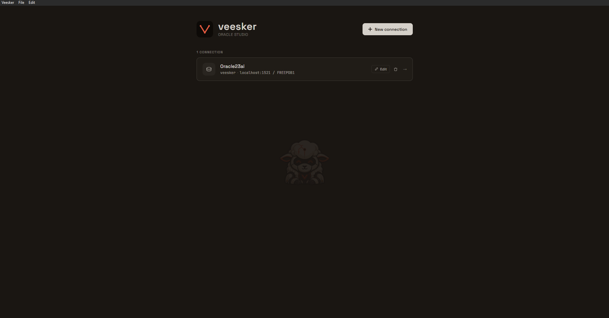<br/>
      <sub>Connections home — manage Oracle 23ai connections</sub>
    </td>
    <td align="center">
      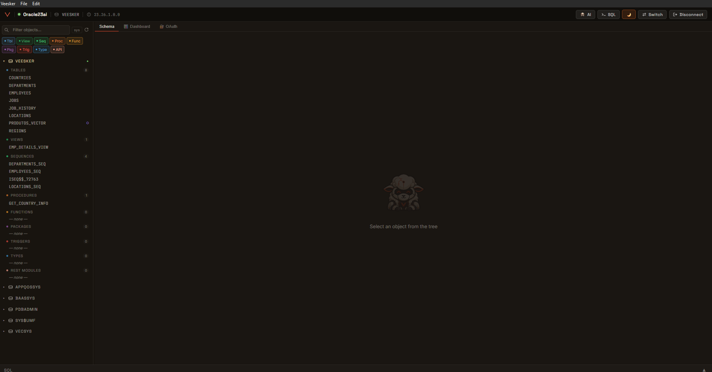<br/>
      <sub>Workspace — schema tree with all object kinds</sub>
    </td>
  </tr>
  <tr>
    <td align="center">
      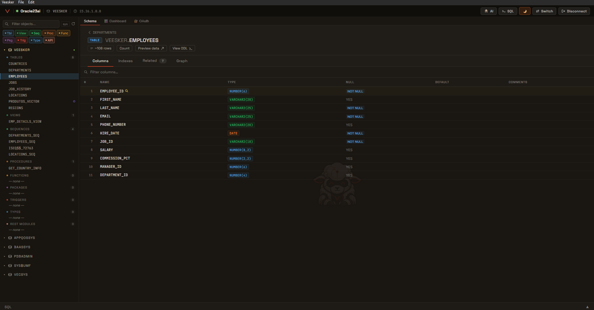<br/>
      <sub>Table inspector — columns, types, nullability</sub>
    </td>
    <td align="center">
      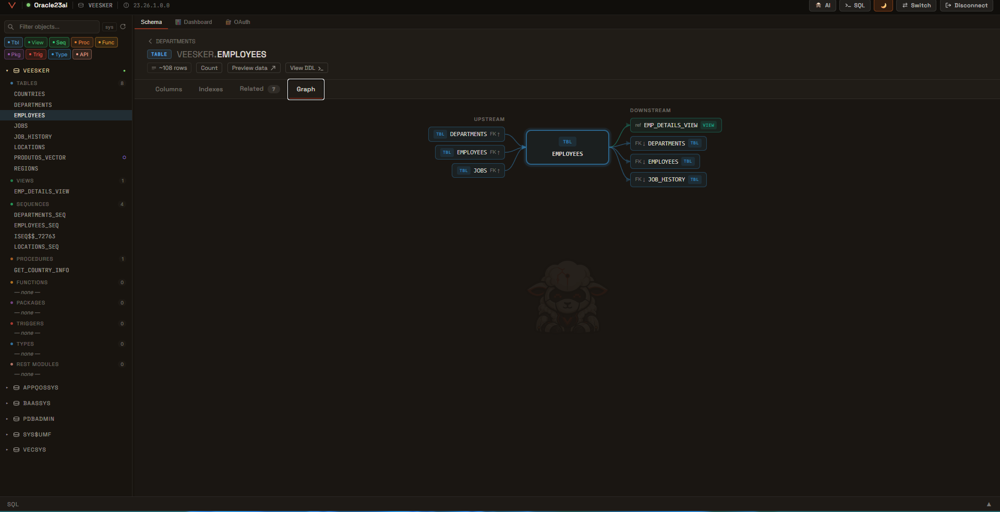<br/>
      <sub>DataFlow — upstream/downstream dependencies via FK & code refs</sub>
    </td>
  </tr>
  <tr>
    <td align="center">
      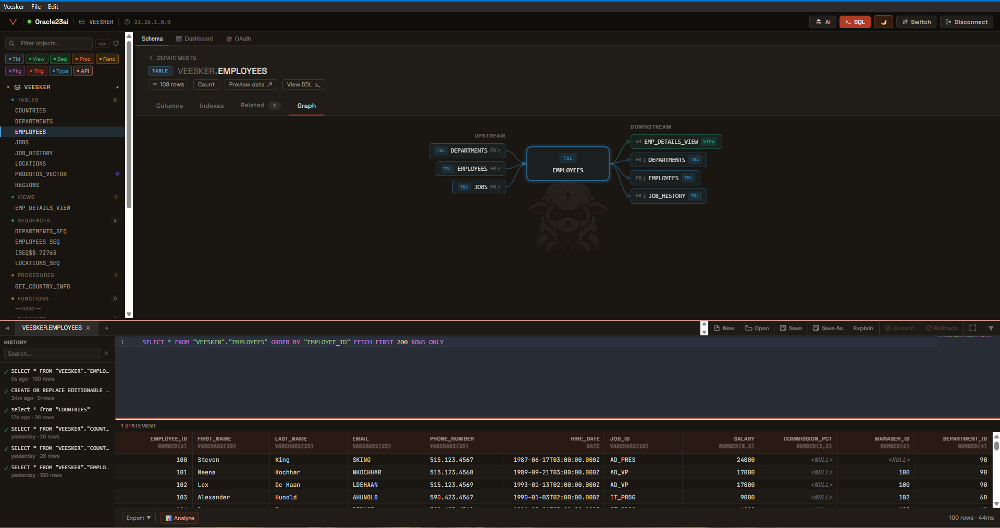<br/>
      <sub>Multi-statement SQL editor with results grid</sub>
    </td>
    <td align="center">
      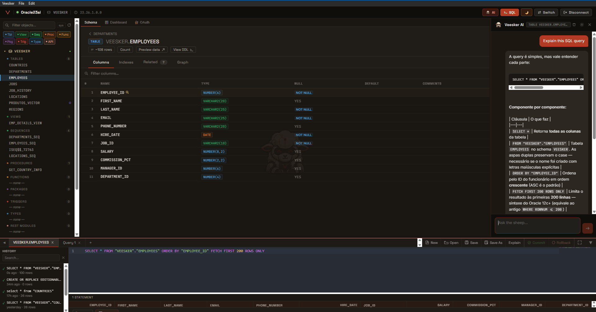<br/>
      <sub>Veesker AI — explain queries, suggest fixes, generate SQL</sub>
    </td>
  </tr>
  <tr>
    <td align="center">
      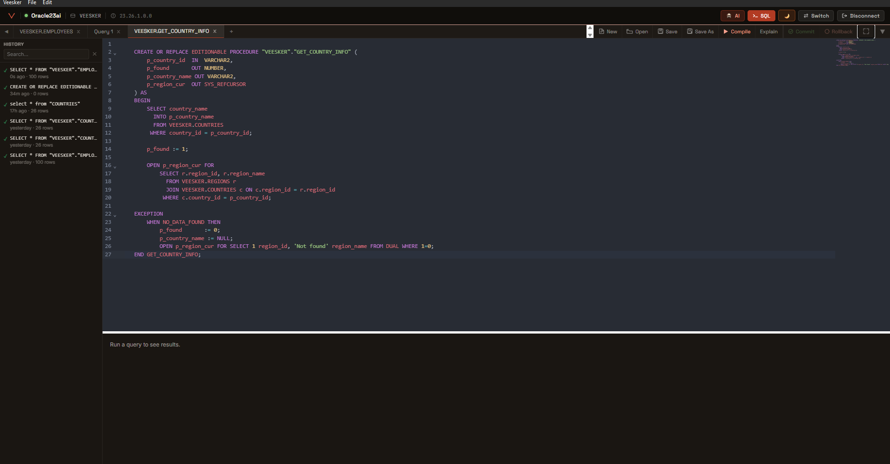<br/>
      <sub>PL/SQL editor — compile, save, view DDL</sub>
    </td>
    <td align="center">
      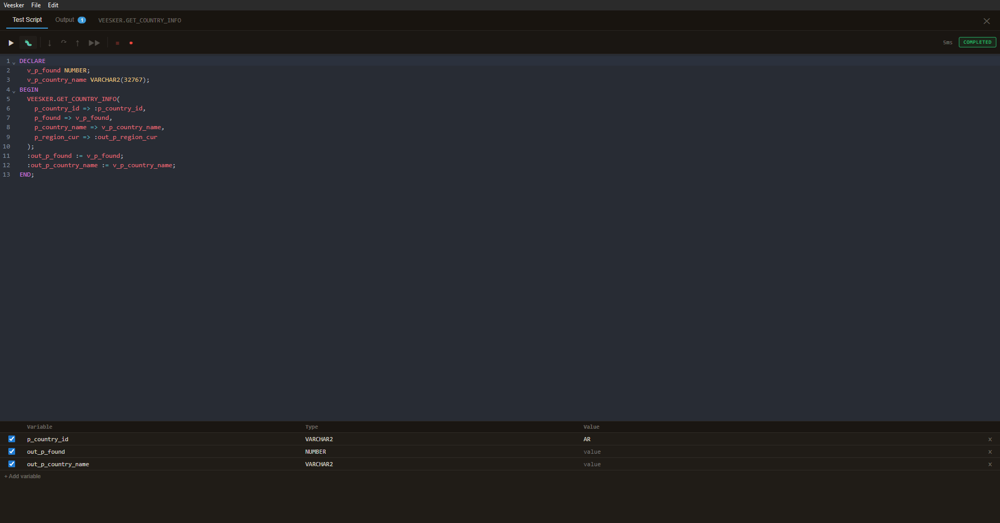<br/>
      <sub>PL/SQL Debugger — breakpoints, step-in/over/out, watch variables</sub>
    </td>
  </tr>
  <tr>
    <td align="center">
      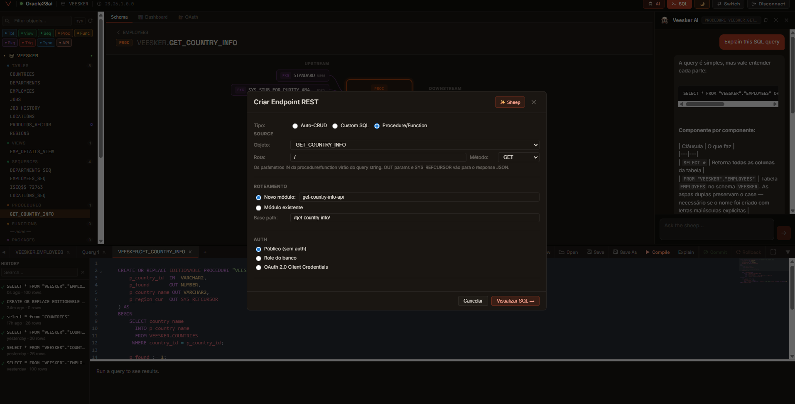<br/>
      <sub>VRAS — visual REST endpoint builder for Oracle ORDS</sub>
    </td>
    <td align="center">
      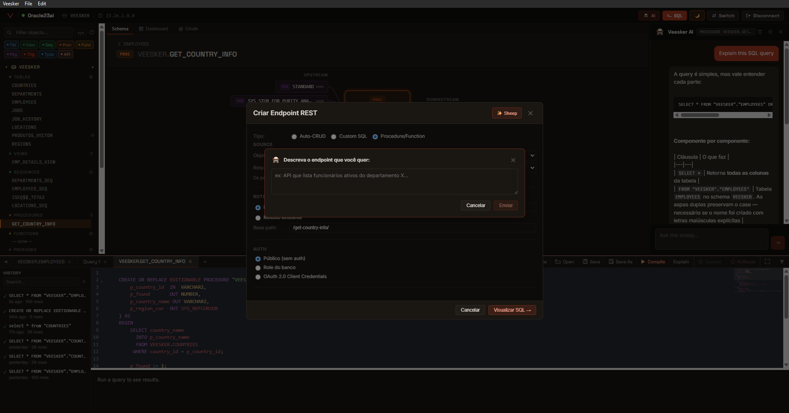<br/>
      <sub>VRAS — describe an endpoint in natural language, AI fills the form</sub>
    </td>
  </tr>
  <tr>
    <td align="center">
      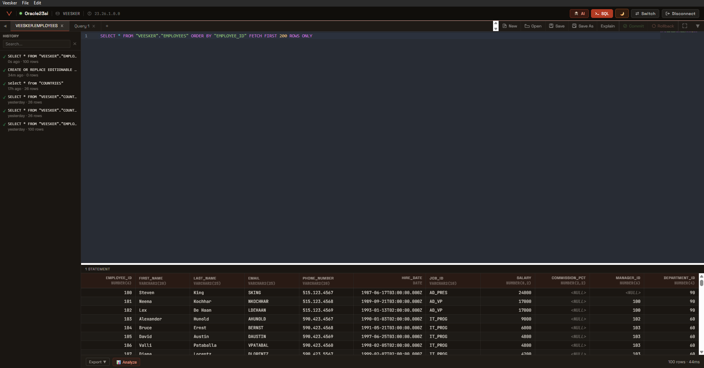<br/>
      <sub>Per-connection query history with timing & row counts</sub>
    </td>
    <td align="center">
      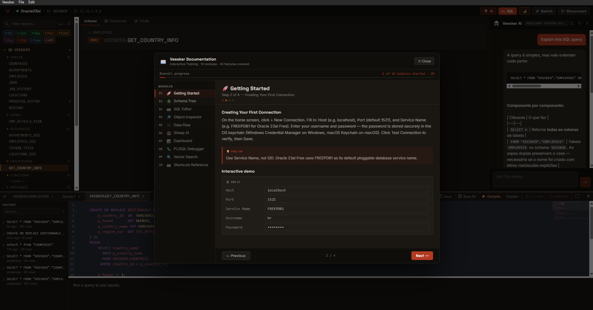<br/>
      <sub>In-app guided onboarding & help center</sub>
    </td>
  </tr>
</table>
</div>

---

## What it is / What it isn't

**What it is:**
- A native desktop Oracle 23ai studio combining SQL editing, schema browsing, vector search, AI assistance, PL/SQL debugging, and REST API generation in a single app
- Zero Oracle client install — connects directly via the Thin driver (pure TypeScript, no native libraries, no JDBC jar)
- An AI assistant with live database access — Sheep can run SELECT queries against your schema to answer questions, not just autocomplete based on training data
- An open-core project — the IDE is Apache 2.0, with the option for separate corporate features under commercial license

**What it isn't:**
- Not a generic multi-database client — DBeaver handles that better
- Not cloud or SaaS — credentials, query history, and database content stay on your machine
- Not a replacement for SQL Developer on Oracle 11g/12c — Veesker targets 23ai and its vector-native + ORDS capabilities specifically
- Not a production-grade tool with warranty — see [terms & disclaimers](#license--disclaimer)

---

## Features

### Connections & Authentication

- **Basic auth** — host / port / service name + username / password
- **Oracle Wallet (mTLS)** — ZIP upload with automatic connect-alias detection and wallet password support; full Autonomous Database compatibility
- **OS keychain integration** — passwords stored via Windows Credential Manager / macOS Keychain / Linux Secret Service via the Rust `keyring` crate
- **Connection switcher** — fast jump between connections without re-authenticating
- **Multi-PDB support** — switch service names per connection

### Schema browser

- **All object kinds** — Tables, Views, Sequences, Procedures, Functions, Packages, Triggers, Types, REST Modules
- **Per-schema vector indicator** — schemas containing tables with VECTOR columns are flagged
- **Smart filtering** — toggle visibility per kind, hide system schemas, full-text search across all objects
- **Object kind counts** — at a glance, see how much is in each schema
- **System schema toggle** — show/hide ANONYMOUS, SYS, MDSYS, etc.

### Table inspector

- **Columns tab** — name, type, nullability, default, comments, primary-key flag, vector indicator
- **Indexes tab** — name, unique flag, columns covered
- **Related tab** — outgoing & incoming foreign keys, dependent objects, constraints, grants
- **DataFlow graph** — visual dependency map showing upstream sources, downstream consumers, FK relationships, and triggers (PL/SQL bodies are scanned for table refs)
- **Quick actions** — preview data (SELECT * with PK ordering, FETCH FIRST 200), exact COUNT, view DDL, navigate to any related object

### SQL editor

- **Multi-statement execution** — full PL/SQL-aware splitter handles strings, comments, q-quoted literals, and `BEGIN..END;` blocks separated by `/`
- **Per-statement results** — each statement gets its own result tab with status (ok/error/cancelled), elapsed time, and row count
- **Cancel running queries** — `Cmd/Ctrl + .` aborts the in-flight statement (server-side `connection.break()`)
- **Run-at-cursor / Run-selection / Run-all** — three execution modes with sensible defaults
- **Sortable & resizable result grid** — virtual-scrolling for large result sets (no UI freeze on millions of rows)
- **Query history** — per-connection SQLite-backed history with elapsed time, row count, error code; click to reload into the editor
- **File I/O** — Save / Save As / Open `.sql` files with file-modified indicator on the tab
- **Multiple tabs** — keep separate working contexts open simultaneously
- **DML safety** — destructive operations (DELETE, UPDATE, DROP, TRUNCATE) trigger a confirmation modal showing impact
- **EXPLAIN PLAN** — visualization of execution plan tree with cost & cardinality
- **Compile errors inline** — for `CREATE PROCEDURE/FUNCTION/PACKAGE`, errors appear in the gutter at the failing line
- **CodeMirror 6** — syntax highlighting, minimap, autocomplete with the schema's actual table/view names

### AI Assistant — Sheep 🐑

- **Live database access** — Sheep runs SELECT queries against your real schema to answer questions, then explains the results
- **Context-aware** — the assistant knows the current schema, currently selected object, and can use the live connection
- **Explain & analyze** — highlight any SQL → "Explain with AI" → Sheep walks through it line by line
- **Generate SQL** — describe what you want in natural language, get a SQL draft to review and run
- **Markdown rendering** — code blocks, inline code, bold, syntax-highlighted
- **API key in OS keychain** — Anthropic API key stored locally via `keyring`; falls back to `ANTHROPIC_API_KEY` env var

### Vector search studio

- **Embedding providers** — Ollama (local), OpenAI, Voyage, custom OpenAI-compatible endpoints
- **HNSW & IVF indexes** — create, drop, parameterize accuracy/distance metric (Cosine, Euclidean, Dot)
- **Similarity search UI** — text input → embeddings → live similarity results sorted by distance
- **2D scatter plot** — PCA-projected vector space, color-coded by similarity score, hover to inspect source rows
- **Embed batch operations** — bulk-embed pending rows in your tables with progress tracking

### PL/SQL features

- **PL/SQL editor** — full CRUD on procedures, functions, packages, triggers, and types with syntax highlighting
- **Compile** — explicit compile button with inline error display
- **Procedure execution modal** — auto-generated form for IN/OUT params, including REF CURSOR results displayed as a result grid
- **PL/SQL Debugger** — Test Window-style debugger:
  - Breakpoints (gutter click or Ctrl+B)
  - Step Into / Step Over / Step Out / Continue
  - Watch variables panel
  - Call stack with current line highlight
  - Output capture (DBMS_OUTPUT)
  - SYS_REFCURSOR result extraction

### VRAS — Veesker REST API Studio

A no-code REST API builder using Oracle ORDS:

- **Auto-CRUD on tables/views** — 1-click `ORDS.ENABLE_OBJECT` with operation selection (GET/POST/PUT/DELETE/GET-by-id)
- **Custom SQL endpoints** — write a parameterized SELECT/DML, define route + method, deploy as ORDS handler
- **Procedure endpoints** — pick any PL/SQL procedure or function, params auto-introspected, JSON serialization via APEX_JSON (handles SYS_REFCURSOR natively)
- **Veesker AI integration** — describe the endpoint in natural language, AI fills the form
- **OAuth 2.0 client management** — create OAuth clients with `client_credentials` grant, role assignment, revoke; secret shown once for safe-keeping
- **Inline HTTP test panel** — send GET/POST/PUT/DELETE requests with auto-injected Bearer tokens, JSON pretty-printed response, status code coloring
- **Module browser** — read existing ORDS modules from `USER_ORDS_*` views, view templates, handlers, and source code
- **Export as SQL** — reverse-engineer any deployed module into a recreatable PL/SQL block (great for promoting between environments)
- **Bootstrap detection** — auto-detects whether ORDS is installed, schema is enabled, user has admin privilege, and base URL is configured; guided modal with one-click "Habilitar agora" when applicable

### Workspace UX

- **Dark / light mode** with smooth transitions
- **Customizable panels** — resize schema tree and AI panel, persisted
- **System tray integration** — minimize to tray, status badges per connection state
- **Command palette** — Ctrl+K for fast navigation
- **Help center & onboarding** — in-app guided tour for new users
- **Auto-update** — Tauri-native updater with Ed25519-signed releases via GitHub Releases
- **Audit trail** — every SQL execution logged to `audit/<date>.jsonl` for compliance

### Cross-platform

- **Windows** — NSIS installer + MSI, runs on Windows 10 (with WebView2) and Windows 11 native
- **macOS** — `.dmg` and `.app`, Apple Silicon and Intel; ad-hoc signing for local builds
- **Linux** — supported via Tauri build (not yet packaged for releases)

---

## Install

### Windows

Download the latest installer from the [Releases page](https://github.com/gevianajr/veesker/releases) and run `Veesker_<version>_x64-setup.exe`.

> The installer is currently unsigned during the pre-release period. Windows SmartScreen will show "Windows protected your PC" — click **More info** → **Run anyway**. Code signing via Azure Trusted Signing or SignPath Foundation is in progress.

### macOS

Download the `.dmg` from the [Releases page](https://github.com/gevianajr/veesker/releases) and drag Veesker into Applications.

> Apple Silicon and Intel are both supported. The app is ad-hoc signed during pre-release; on first launch you may need to **Right-click → Open** to bypass Gatekeeper.

### Linux

Build from source — see below. Packaged Linux releases are not yet available.

---

## Build from source

See [CLAUDE.md](CLAUDE.md) for the full development setup. Quick version:

```bash
# Prerequisites: Bun ≥ 1.1, Rust stable, MSVC (Win) or Xcode CLT (macOS)

# Clone & install
git clone https://github.com/gevianajr/veesker.git
cd veesker
bun install
cd sidecar && bun install && cd ..

# Compile sidecar binary (path differs by OS)
cd sidecar
bun build src/index.ts --compile --target=bun-windows-x64 \
  --outfile ../src-tauri/binaries/veesker-sidecar-x86_64-pc-windows-msvc.exe
cd ..

# Run dev mode (Vite + Tauri shell + sidecar live reload)
bun run tauri dev

# Or build a production installer
bun run tauri build
```

Outputs land in `src-tauri/target/release/bundle/`.

For auto-update setup, see [docs/AUTO_UPDATE.md](docs/AUTO_UPDATE.md).
For Windows code signing, see [docs/CODE_SIGNING.md](docs/CODE_SIGNING.md).

---

## Architecture

```
┌──────────────────────────────────────────────────────────┐
│  Tauri 2 desktop shell (Rust)                            │
│  └── WebView2 / WKWebView                                │
│      └── SvelteKit 5 frontend (Svelte 5 runes)           │
│          └── invoke() → Tauri commands → JSON-RPC stdio  │
├──────────────────────────────────────────────────────────┤
│  Bun sidecar (TypeScript, compiled to native binary)     │
│  └── node-oracledb Thin driver → Oracle 23ai             │
│  └── Anthropic SDK → Claude API                          │
│  └── Embedding providers (Ollama / OpenAI / Voyage)      │
└──────────────────────────────────────────────────────────┘
```

- **Frontend:** Svelte 5 with runes (`$state`, `$derived`, `$effect`), CodeMirror 6 for SQL editing, Chart.js for the dashboard, Tauri 2 for native APIs
- **Sidecar:** Bun-compiled TypeScript binary handles all Oracle communication via JSON-RPC over stdin/stdout
- **Rust shell:** thin Tauri command layer delegating everything to the sidecar; persistence (SQLite for connections + history) and OS keychain integration live in Rust
- **No CGO, no JNI, no Oracle Instant Client:** node-oracledb Thin mode is pure JavaScript

---

## Documentation

- **[CLAUDE.md](CLAUDE.md)** — full development setup, Windows + macOS, troubleshooting
- **[CONTRIBUTING.md](CONTRIBUTING.md)** — contribution guidelines, code conventions, PR workflow
- **[CODE_OF_CONDUCT.md](CODE_OF_CONDUCT.md)** — Contributor Covenant 2.1
- **[SECURITY.md](SECURITY.md)** — security disclosure policy
- **[TERMS_OF_USE.md](TERMS_OF_USE.md)** — terms of use, warranty disclaimer, liability limitation
- **[COMMERCIAL_USE.md](COMMERCIAL_USE.md)** — commercial use policy (Docker-style)
- **[docs/PRICING.md](docs/PRICING.md)** — subscription tiers, add-ons, FAQ
- **[docs/AUTO_UPDATE.md](docs/AUTO_UPDATE.md)** — Tauri updater configuration & release process
- **[docs/CODE_SIGNING.md](docs/CODE_SIGNING.md)** — Azure Trusted Signing setup for Windows
- **[docs/superpowers/specs/](docs/superpowers/specs/)** — design specs for major features (debugger, security, VRAS)
- **[docs/superpowers/plans/](docs/superpowers/plans/)** — implementation plans for major features

---

## Pricing & commercial use

Veesker follows the **Docker Desktop / Kubernetes pattern**: the **entire codebase is open source under Apache 2.0** (no feature gating, ever). Larger organizations support development through a paid subscription for the packaged desktop app + support.

| Tier | Price | Eligible | Includes |
|---|---|---|---|
| **Personal** | Free | Personal use, OSS, education, ≤50 employees AND ≤US$ 5M revenue | Full IDE, all features, best-effort support |
| **Pro** | R$ 49 / month per user | Individuals, freelancers | Email support 5 business days, commercial use right |
| **Business** | R$ 199 / month per seat | Companies of any size | 1-business-day SLA, Slack channel, Veesker Cloud (when available), team add-ons |
| **Enterprise** | Custom | Custom needs, regulated industries | 4h SLA, dedicated engineer, on-prem AI, SSO, indemnification |

**Commercial use clause** — companies with **50+ employees** OR **US$ 5M+ annual revenue** require a paid subscription to use the official packaged Veesker app. The source code is always free under Apache 2.0. See [COMMERCIAL_USE.md](COMMERCIAL_USE.md).

**No technical enforcement** — Veesker has no telemetry, no license server check, no degraded experience. Compliance is honor-based + EULA. Same model as Docker Desktop.

**Add-ons available for any tier:** Oracle EBS Pack (R$ 4.000/year), AWR Analyzer (R$ 1.500/year), Azure OpenAI / AWS Bedrock connectors, Compliance Pack BR (LGPD/BACEN-ready audit), and more.

See [docs/PRICING.md](docs/PRICING.md) for full details. Free for **active open-source maintainers** — apply with your project link.

**Contact:** geefatec@gmail.com

---

## License & disclaimer

Veesker is released under the [Apache License 2.0](LICENSE).

**No warranty.** Veesker is provided "AS IS" and "AS AVAILABLE", without warranty of any kind. The maintainer is not liable for damages arising from the use of the software, including but not limited to data loss, security incidents, downtime, or regulatory non-compliance. See [TERMS_OF_USE.md](TERMS_OF_USE.md) for the full terms.

**User responsibility.** You are responsible for:
- Validating Veesker's behavior in non-production before any production use
- Backing up your data before connecting Veesker to a database
- Reviewing any AI-generated SQL/PL/SQL/REST configuration before applying it
- Ensuring your use complies with applicable laws and your organization's policies

**No telemetry.** The open-source build collects no usage data. Connections, credentials, and query history stay on your machine.

---

## Contributing

See [CONTRIBUTING.md](CONTRIBUTING.md). All contributors must agree to the Apache 2.0 license terms. We use Conventional Commits and require tests for non-trivial changes.

For security issues, please report privately via [SECURITY.md](SECURITY.md).

---

## Acknowledgments

- [Tauri](https://tauri.app) — for making native desktop apps with web tech actually work
- [Svelte 5](https://svelte.dev) — runes are a joy to write
- [node-oracledb Thin mode](https://oracle.github.io/node-oracledb/) — Oracle without the Instant Client tax
- [Anthropic Claude](https://anthropic.com) — for Sheep's brain
- [Oracle 23ai](https://oracle.com/database/free) — for being the first Oracle that takes vectors seriously

---

<div align="center">

Built by [Geraldo Viana Jr](https://github.com/gevianajr) - Brazil

[veesker.cloud](https://veesker.cloud) · [GitHub](https://github.com/gevianajr/veesker) · [Issues](https://github.com/gevianajr/veesker/issues) · [](https://www.linkedin.com/in/geraldovianajr/)

</div>
