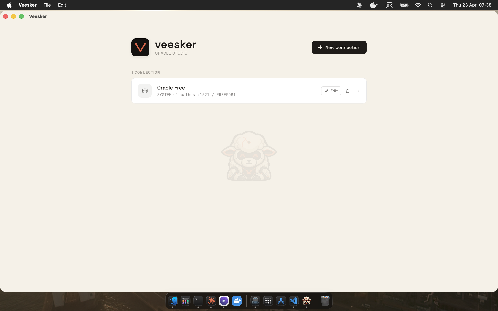
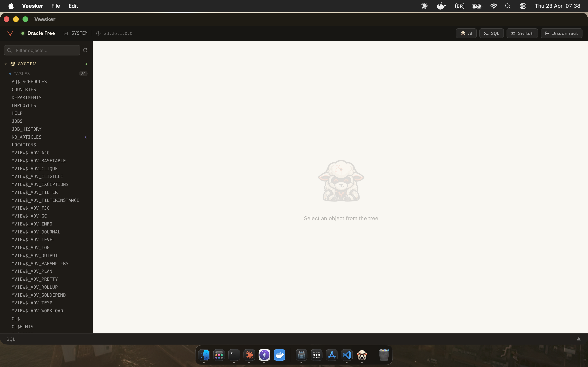
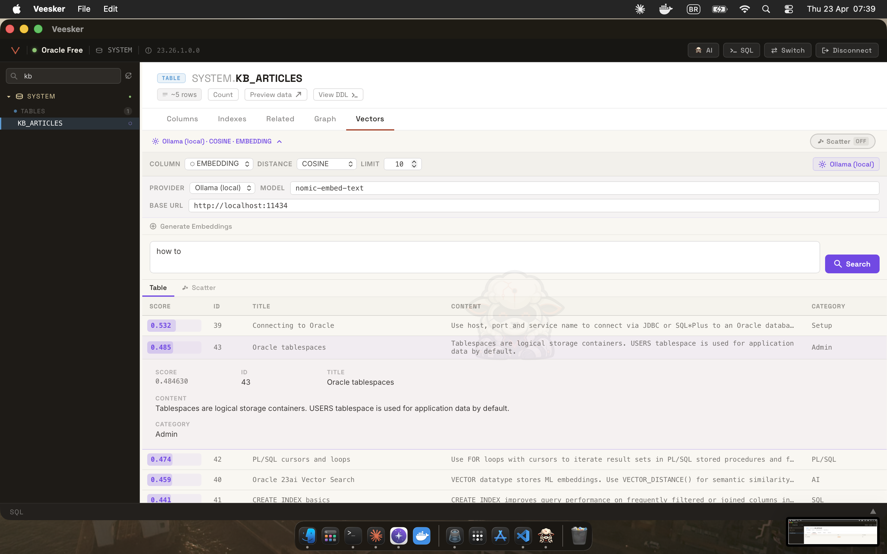
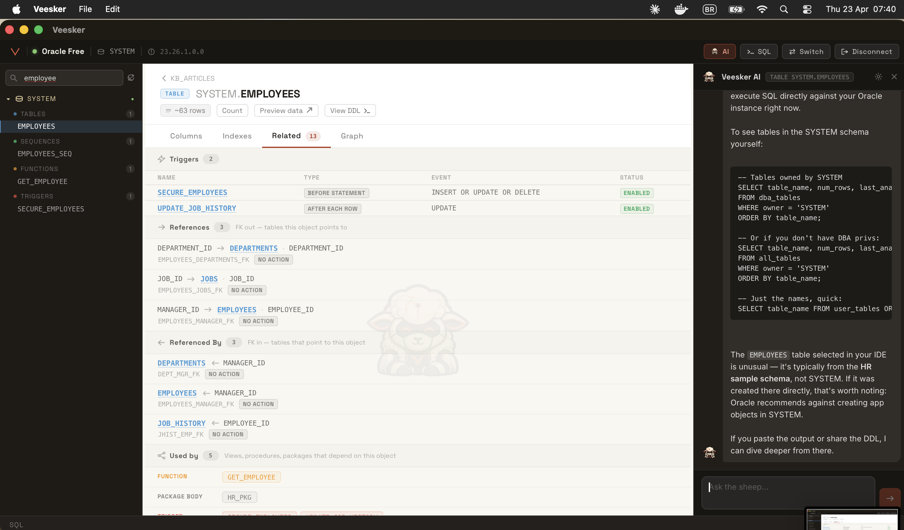
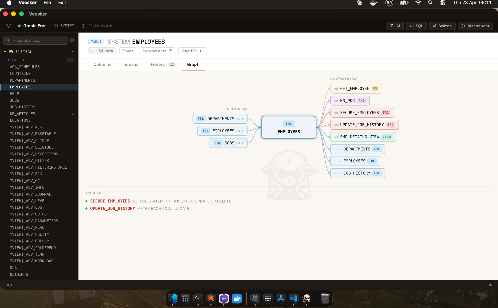

<div align="center">


# Veesker

The Oracle 23ai studio built for vectors, SQL, and AI.

Veesker is a native desktop IDE for Oracle 23ai with a built-in vector search studio, a multi-statement SQL editor, and an AI assistant with live database access. It connects via the Oracle Thin driver — no Oracle Instant Client or JDBC jar required, on any machine.

[](LICENSE) [](https://tauri.app) [](https://svelte.dev) [](https://oracle.com) []()

[veesker.dev](https://veesker.dev)

</div>

---

## Screenshots

<div align="center">
<table>
  <tr>
    <td align="center">
      <br/>
      <sub>Connections home</sub>
    </td>
    <td align="center">
      <br/>
      <sub>Schema browser</sub>
    </td>
  </tr>
  <tr>
    <td align="center">
      <br/>
      <sub>Vector search studio with 2D scatter plot</sub>
    </td>
    <td align="center">
      <br/>
      <sub>AI assistant — Veesker 🐑 queries your database live</sub>
    </td>
  </tr>
  <tr>
    <td align="center" colspan="2">
      <br/>
      <sub>DataFlow — upstream/downstream dependencies and foreign keys</sub>
    </td>
  </tr>
</table>
</div>

---

## What it is / What it isn't

**What it is:**
- A native desktop Oracle 23ai studio with a vector search studio and AI assistant built in, not bolted on
- Zero Oracle client install — connects directly to Oracle via the Thin driver (pure TypeScript, no native libraries)
- First-class vector search: generate embeddings with Ollama/OpenAI/Voyage, manage HNSW/IVF indexes, run semantic queries, and inspect results with a 2D scatter visualization
- An AI assistant that runs live SELECT queries against your schema to answer questions — not autocomplete, actual database access

**What it isn't:**
- Not a generic multi-database client — DBeaver handles that better
- Not cloud or SaaS — your credentials and database queries never leave your machine
- Not a replacement for SQL Developer on Oracle 11g/12c — Veesker targets 23ai and its vector-native capabilities specifically

---

## Features

### Connections & Authentication

- **Basic auth:** host / port / service name + username / password
- **Oracle Wallet (mTLS):** ZIP upload, automatic connect alias detection, wallet password support — full support for Oracle Autonomous Database
- **Secure credential storage:** OS keychain via Rust `keyring` crate — macOS Keychain, Windows Credential Manager, Linux Secret Service; secrets never touch disk as plaintext
- **Connection test before save:** validates credentials, returns Oracle server version
- **Multiple named connections** persisted in local SQLite with creation and update timestamps
- Full connection CRUD from the home screen

---

### SQL Editor & Execution

- **CodeMirror 6** with Oracle PL/SQL syntax highlighting and One Dark theme
- **Multi-tab per connection**, open tab state persisted in localStorage across sessions
- **Cursor-aware execution (⌘Enter):** detects the statement under the caret and runs only that one
- **Selection execution:** runs only the highlighted text
- **Run all (⌘⇧Enter / F5):** passes the full buffer through the SQL splitter — handles `;`, `/` on its own line for PL/SQL blocks, Q-quoted strings, and line/block comments correctly
- **In-flight query cancellation** via ⌘. or the UI cancel button
- **File handling:** open, save, save-as via the system dialog, with dirty state indicator (●)
- **Inline compile error markers** rendered as CodeMirror diagnostics with gutter icons
- **Concurrency guard:** a second query is blocked while one is already running on the shared connection

---

### Results & DBMS_OUTPUT

- Multi-statement result tabs — one tab per executed statement, each with its own status, rows, and timing
- Per-statement status: `ok` / `error` / `cancelled` / `running`
- DBMS_OUTPUT captured per statement (up to 10,000 lines), rendered alongside the result
- PL/SQL compile errors fetched from `user_errors` and shown inline after execution
- **Result grid:** column resizing (drag handles), 3-state column sorting, smooth scroll
- **CSV and JSON export** with system-save dialog
- NULL rendered as `<NULL>`, dates as ISO 8601, TypedArrays (from VECTOR columns) as plain arrays

---

### Schema Navigation

- Resizable schema tree panel (160–480px), current schema highlighted with `●`
- Eight object kinds: TABLE, VIEW, SEQUENCE, PROCEDURE, FUNCTION, PACKAGE, TRIGGER, TYPE
- Object count per kind per schema, loaded on first expand
- Real-time text search filter across schema name and object name (debounced)
- PL/SQL object status badges: VALID / INVALID
- VECTOR column detection at schema scan time, surfaced in the Vectors tab

---

### Object Details (center panel)

| Tab | What it shows |
|---|---|
| **Columns** | Name, type (with precision/scale), nullable, PK, default value, comments, VECTOR column flag |
| **Indexes** | Name, uniqueness, column list |
| **Related** | Triggers, FK outgoing/incoming, dependents, check constraints, grants |
| **Dataflow** | Bezier graph of upstream/downstream code dependencies, FK parents/children, triggers |
| **Vectors** | Embedding generation, semantic search, scatter plot, vector index management |

Additional actions: DDL viewer (opens CREATE statement in the editor), on-demand row count, table preview with PK-ordered SELECT, back navigation with session history.

---

### Vector Search Studio

> Vector search is not a roadmap item — it ships in the current build. Veesker is the only native Oracle IDE with a built-in embedding, indexing, and search studio for Oracle 23ai `VECTOR` columns.

**Embedding providers:**

| Provider | Mode | Model default |
|---|---|---|
| Ollama | Local, no key required | `nomic-embed-text` |
| OpenAI | API key | `text-embedding-3-small` |
| Voyage AI | API key | `voyage-3-lite` |
| Custom | Any POST-compatible endpoint | — |

**Operations:**
- Detect pending rows (rows where the VECTOR column is NULL)
- Batch embedding with live progress counter (embedded / total / errors), cancellable at any point
- Semantic similarity search with COSINE, EUCLIDEAN, or DOT distance
- Optional: include raw vectors in results for visualization
- 2D scatter plot via PCA (60-iteration power iteration, deterministic seed) — result points color-coded by similarity score (green → orange → red), query vector plotted separately as `Q`
- Re-search CTA when scatter was opened without vectors included

**Vector index management:**
- List existing vector indexes for any table
- Create HNSW or IVF index with configurable metric and accuracy target
- Drop index with confirmation dialog

---

### Veesker AI 🐑 — AI Assistant

The AI panel (⌘I) runs a cyberpunk sheep named Veesker. Powered by Claude via the Anthropic API — key stored in the OS keychain, or read from the `ANTHROPIC_API_KEY` environment variable.

**Live database tools (read-only):**

| Tool | What it does |
|---|---|
| `describe_object` | Returns columns, indexes, constraints, and statistics for any table or view |
| `run_query` | Executes a SELECT or WITH query and returns up to 50 rows |
| `get_ddl` | Returns the full DDL for any Oracle object |
| `list_objects` | Lists objects of a given kind within a schema |

The AI uses these tools autonomously to answer questions — it will describe a table, run a quick SELECT to verify an assumption, and cite real column names rather than guessing.

**Safety:**
- SQL guard strips comments, then rejects any statement containing INSERT / UPDATE / DELETE / CREATE / DROP / ALTER / EXEC / BEGIN / COMMIT / ROLLBACK — the AI cannot mutate the database
- Prompt-injection mitigation: triple-backtick sequences inside the active SQL are sanitized before being sent to the model, preventing code-fence escapes in the system prompt
- Context-aware: knows the current schema, selected object, and active SQL in the editor
- Full multi-turn conversation history
- Markdown rendering: fenced code blocks with language hints, inline code, bold, and line breaks

---

### Transactions & Session Management

- Commit and Rollback buttons in the status bar and SQL drawer (disabled when no pending transaction)
- TX badge in the status bar (yellow) when uncommitted DML has been executed
- DBMS_OUTPUT auto-enabled for multi-statement execution runs
- Lost-session detection — handles ORA-03113, ORA-03114, NJS-003, NJS-500, DPI-1010 with automatic session cleanup and a reconnect prompt

---

### Query History

- Per-connection history persisted in local SQLite
- Full-text search across SQL text, debounced at 200ms
- Infinite-scroll pagination (50 entries per page)
- Per-entry display: SQL preview, success/failure indicator, row count, elapsed time, error code if applicable, relative timestamp
- Click any entry to open it in the editor

---

## Security

Veesker is designed for enterprise use — the following controls are active in the shipped build.

- **Strict Content Security Policy** on the WebView: inline scripts blocked, frames blocked (`frame-src 'none'`), plugin embeds blocked (`object-src 'none'`), `connect-src` restricted to Anthropic's API and `localhost:1420` (dev server only)
- **Sidecar process isolation:** the Oracle driver runs in a separate Bun process; if it crashes, the UI stays responsive; if it were compromised, it cannot read the keychain directly
- **Credentials never on disk:** every secret — Oracle passwords, wallet password, Anthropic API key — lives exclusively in the OS keychain via the Rust `keyring` crate
- **Oracle identifier validation:** every object name interpolated into a SQL string passes through `[A-Za-z0-9_$#]{1,128}` — mitigates injection on metadata DDL where bind parameters are not available (e.g., `CREATE INDEX ... ON owner.table`)
- **Embedding URL validation:** custom endpoint URLs are validated to block cloud-metadata addresses (`169.254.x.x`, GCP, Azure) to prevent SSRF from the custom provider feature
- **AI read-only enforcement:** the `run_query` tool strips comments before checking for DML/DDL keywords — the AI tools cannot mutate data regardless of what the conversation history contains
- **Prompt injection mitigation:** triple-backtick sequences inside the active SQL are sanitized before being embedded in the system prompt
- **Concurrency guard:** `queryExecute` throws immediately if another query is in flight on the same connection, preventing race conditions on the shared Oracle session

---

## Stack

| Layer | Technology |
|---|---|
| Desktop shell | [Tauri 2](https://tauri.app) (Rust) |
| Frontend | [SvelteKit](https://kit.svelte.dev) + Svelte 5 runes + TypeScript |
| SQL editor | [CodeMirror 6](https://codemirror.net) |
| Oracle driver | [`node-oracledb`](https://node-oracledb.readthedocs.io) Thin mode via Bun sidecar |
| AI | [Anthropic SDK](https://github.com/anthropics/anthropic-sdk-typescript) / Claude API / Claude Code fallback |
| Embeddings | Ollama, OpenAI, Voyage AI, custom endpoints |
| App state | SQLite (bundled via Rust `rusqlite`) |
| Credentials | OS keychain (Rust `keyring` — Apple native, Windows native, Linux Secret Service) |
| Vector visualization | Custom 2D PCA — power iteration, 60 iterations |

The Oracle driver runs in a **Bun sidecar** — a TypeScript process compiled to a single standalone binary per platform that communicates with the Tauri Rust shell via JSON-RPC over stdin/stdout. This keeps `node-oracledb` Thin mode working inside a Rust-native app while adding zero Oracle Instant Client requirement for the end user. See [ARCHITECTURE.md](ARCHITECTURE.md) for the full design rationale.

---

## Platform Support

| Platform | Status |
|---|---|
| macOS (Apple Silicon) | ✅ Supported |
| macOS (Intel) | ✅ Supported |
| Windows | 🟡 In progress |
| Linux | 🟡 In progress |

---

## Getting Started

### Prerequisites

- [Bun](https://bun.sh) ≥ 1.1
- [Rust](https://rustup.rs) stable toolchain
- Tauri platform prerequisites → [guide](https://tauri.app/start/prerequisites/)
- Oracle Database 23ai (local Docker or remote)

### Dev mode

```bash
git clone https://github.com/geeviana/veesker.git
cd veesker
bun install
cd sidecar && bun install && cd ..
bun run tauri dev
```

The first screen is the connections home, where you can create a new connection with the **New connection** button. Basic auth (host/port/service) and Oracle Wallet are both supported.

### Production build

```bash
# Compile the sidecar binary for the current platform
cd sidecar && bun build src/index.ts --compile --minify \
  --outfile ../src-tauri/binaries/veesker-sidecar-$(rustc -vV | sed -n 's|host: ||p')
cd ..

# Build the Tauri app
bun run tauri build
```

---

## Keyboard Shortcuts

| Shortcut | Action |
|---|---|
| ⌘K | Command palette — search all objects |
| ⌘I | Toggle AI assistant |
| ⌘J | Toggle SQL drawer |
| ⌘Enter | Run SQL at cursor |
| ⌘⇧Enter / F5 | Run all statements |
| ⌘. | Cancel running query |
| ⌘N | New tab |
| ⌘W | Close active tab |
| ⌘O | Open SQL file |
| ⌘S | Save |
| ⌘⇧S | Save As |
| ⌘⇧E | Expand editor mode |

---

## Roadmap

**Shipped (v0.x):**
- [x] Oracle Thin-mode connection with Basic + Wallet auth
- [x] SQL editor with multi-statement execution and PL/SQL splitter
- [x] Schema browser across 8 object kinds
- [x] Vector Search Studio with multi-provider embeddings
- [x] HNSW / IVF index management
- [x] 2D scatter visualization via PCA
- [x] AI assistant with live database tools
- [x] Query history with full-text search
- [x] DataFlow dependency graphs
- [x] DBMS_OUTPUT capture

**Next (v1.0):**
- [ ] Windows and Linux builds
- [ ] RAG pipeline builder (PDF → chunk → embed → store → retrieve → generate)
- [ ] OpenAI / Ollama providers for the AI assistant (currently Claude-only)
- [ ] Collaborative workspaces (read-only shared schema views)
- [ ] SQL formatter with PL/SQL block awareness

**Exploring:**
- [ ] Oracle APEX workspace integration
- [ ] Oracle EBS schema presets
- [ ] Fine-tuning playground for embedding models

---

## Project Structure

```
veesker/
├── src/                          # SvelteKit frontend
│   ├── routes/
│   │   ├── +page.svelte          # Connections home
│   │   ├── connections/          # New / edit connection forms
│   │   └── workspace/[id]/       # Main IDE workspace
│   └── lib/
│       ├── workspace/            # UI components
│       │   ├── StatusBar.svelte
│       │   ├── SchemaTree.svelte
│       │   ├── ObjectDetails.svelte
│       │   ├── SqlDrawer.svelte
│       │   ├── SqlEditor.svelte
│       │   ├── ResultGrid.svelte
│       │   ├── ExecutionLog.svelte
│       │   ├── QueryHistory.svelte
│       │   ├── VectorScatter.svelte
│       │   ├── DataFlow.svelte
│       │   ├── CommandPalette.svelte
│       │   ├── SheepChat.svelte
│       │   └── CompileErrors.svelte
│       └── stores/
│           └── sql-editor.svelte.ts  # Tab state, execution, expand mode
├── sidecar/                      # Bun TypeScript sidecar
│   └── src/
│       ├── index.ts              # JSON-RPC stdin/stdout dispatcher
│       ├── oracle.ts             # All Oracle queries and session management
│       ├── ai.ts                 # Anthropic SDK + tool execution
│       ├── embedding.ts          # Multi-provider embedding generation
│       ├── state.ts              # Active session state
│       ├── errors.ts             # RPC error codes
│       └── handlers.ts           # RPC method registry
├── src-tauri/                    # Tauri Rust shell
│   ├── src/
│   │   ├── lib.rs                # App setup, sidecar spawn, plugin registration
│   │   └── commands.rs           # Tauri commands exposed to the frontend
│   ├── binaries/                 # Compiled sidecar binaries (per platform)
│   └── tauri.conf.json           # App config, CSP, bundle settings
├── docs/
│   └── screenshots/              # Screenshots used in README
└── static/
    └── veesker-sheep.png         # The mascot
```

---

## Contributing

Issues and pull requests are welcome. See [CONTRIBUTING.md](CONTRIBUTING.md) for how to set up a dev environment, code style expectations, and the PR process. All contributors must sign the CLA via CLA Assistant (linked in the PR check). See [CODE_OF_CONDUCT.md](CODE_OF_CONDUCT.md).

---

## License

Code is licensed under the [Apache License 2.0](LICENSE) — free to use, fork, and build on.

## Trademark Policy

"Veesker" and the Veesker sheep mascot are trademarks of Geraldo Ferreira Viana Júnior. The code is open source (Apache 2.0), but the name and logo are not. Forks must be renamed and must not use the Veesker sheep mascot.

For commercial or promotional use of the Veesker name or mascot, contact geeviana@gmail.com.

---

<div align="center">
  <sub>Built with care (and a cyberpunk sheep) by <a href="https://github.com/geeviana">@geeviana</a></sub>
  <br>
  <sub><a href="ARCHITECTURE.md">Architecture</a> · <a href="https://veesker.dev">veesker.dev</a> · <a href="https://twitter.com/geevianajr">Twitter</a></sub>
</div>
