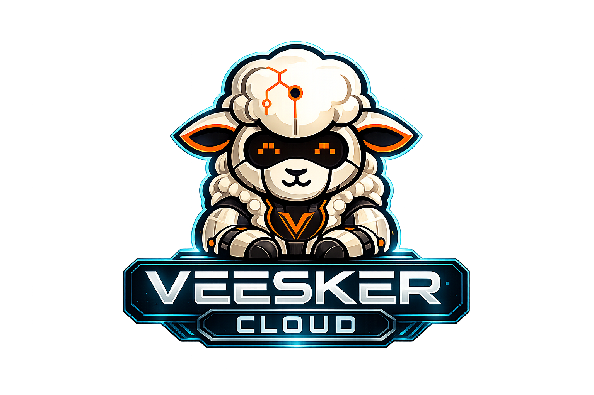
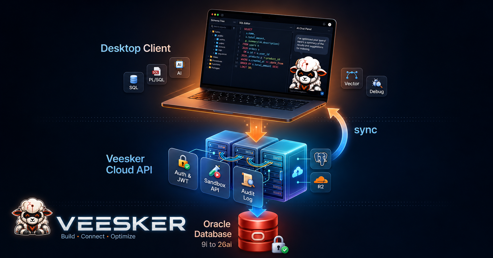

<div align="center">



# Veesker Cloud Edition

**The Oracle desktop IDE — with cloud AI, team features, and Vision.**

All features from Community Edition, plus schema-aware AI, Veesker Vision (object relationship graph), team collaboration, usage dashboard, and managed billing — powered by a Veesker Cloud subscription.

[](https://veesker.cloud/pricing) [](https://tauri.app) [](https://svelte.dev) [](https://oracle.com)

[veesker.cloud](https://veesker.cloud) · [Pricing](https://veesker.cloud/pricing) · [CE vs Cloud](#community-edition-vs-cloud)

</div>

---

> **This is a private repository.** Cloud Edition source code is proprietary and not open-source. The Community Edition codebase (Apache 2.0) lives at [veesker-cloud/veesker-community-edition](https://github.com/veesker-cloud/veesker-community-edition).

---

## Community Edition vs Cloud

| Feature | Community Edition | Cloud |
|---|:---:|:---:|
| SQL Editor (multi-statement) | ✅ | ✅ |
| PL/SQL Editor + Compile + Debug | ✅ | ✅ |
| Schema Browser | ✅ | ✅ |
| Table Inspector (columns, indexes, FKs, DDL) | ✅ | ✅ |
| EXPLAIN PLAN | ✅ | ✅ |
| Transaction management | ✅ | ✅ |
| Terminal (PTY) | ✅ | ✅ |
| ORDS / REST API Studio | ✅ | ✅ |
| Object Versioning | ✅ | ✅ |
| Visual Flow / DataFlow | ✅ | ✅ |
| Auto-update | ✅ | ✅ |
| **AI — Explain SQL / Generate SQL (BYOK)** | ✅ free | ✅ |
| **AI — Schema-aware (knows your DB)** | — | ✅ Cloud |
| **AI — Query optimization + performance** | — | ✅ Cloud |
| **AI — Charts via natural language** | — | ✅ Cloud |
| **Veesker Vision — object relationship graph** | — | ✅ Cloud |
| **SQL Audit Log (cloud-synced)** | — | ✅ Cloud |
| **Team features + shared queries** | — | ✅ Cloud |
| **VeeskerDB Sandbox — production data sharing** | — | ✅ Cloud |
| **Usage dashboard + billing** | — | ✅ Cloud |

**[→ See Cloud plans at veesker.cloud/pricing](https://veesker.cloud/pricing)**

---

## Cloud-exclusive features

### Veesker Vision

An Obsidian-style force-directed graph of your Oracle schema. Click any object — table, view, package, procedure — and Vision expands its transitive dependency graph: FKs, PL/SQL references, triggers, downstream consumers. Click a node to open a detail drawer with DDL, compile errors, version history, and audit history, all in one place.

### Schema-aware AI

The AI assistant connects directly to your live schema. It can run SELECT queries, inspect table structures, explain query plans, and answer questions about your actual data — not just autocomplete from training data.

### Cloud SQL Audit

Every SQL execution logged to `api.veesker.cloud` in real time (batched, via the Rust command layer — survives WebView2 issues). Query the audit log from the UI: filter by connection, date, error code, or SQL pattern.

### VeeskerDB Sandbox

End-to-end encrypted production data sharing for Oracle teams. Owner picks a slice of a real Oracle schema; Veesker introspects the FK graph, applies PII masks, encrypts the result with per-recipient envelopes, and publishes via Veesker-hosted infrastructure. Members pull, decrypt locally, and query as in-memory DuckDB.

**Owner workflow:**
- `SandboxBuildSpec` — schema + tables allowlist, FK walk depth (1-5), TTL (1-90 days), PII level (0/1/2)
- Auto-introspection via `ALL_TAB_COLUMNS` + bounded BFS over the FK graph (edge-deduped, lookup-table heuristic)
- PII detector — column-name + sample-value scan, BR-aware (CPF / CNPJ / email / phone formats); 4 mask types (hash / redact / static / partial)
- DuckDB host stages the result; libsodium ChaCha20-Poly1305 encrypts the blob; X25519 envelopes are sealed for each declared recipient

**Distribution:**
- Encrypted blob uploads to Cloudflare R2 via presigned URLs; metadata + envelopes persisted in `api.veesker.cloud` Postgres
- API never receives plaintext or content keys — sealed envelopes flow through unmodified
- Member grants are explicit; revoke is real (background sidecar watch removes the sandbox from the member's list within seconds)

**Member workflow:**
- Auto-silent X25519 keypair onboarding on first visit (private key in OS keychain, public key registered with API)
- Pull → SHA256-verified blob cache locally → unseal recipient envelope → in-memory DuckDB session
- Full DuckDB SQL on the slice; CTAS / INSERT / temp tables allowed — all changes evaporate on close
- TTL-bounded; expiration removes the sandbox from the cache automatically

**Format:**
- `.vsk` — open encrypted format; engine source in [`veesker-community-edition`](https://github.com/veesker-cloud/veesker-community-edition) under Apache 2.0
- Per-recipient sealing means the same `.vsk` can be distributed to N members; each unseals only their envelope

---

## Architecture

<div align="center">

<sub>System datamap — Cloud Edition extends the open Community Edition with managed AI, Vision, Sandbox, and team features routed through <code>api.veesker.cloud</code></sub>
</div>

### Component map

```mermaid
flowchart TB
    classDef ceStyle fill:#FFF1ED,stroke:#E85D3C,stroke-width:2px,color:#7C2D12
    classDef clStyle fill:#E0EFFF,stroke:#0A84FF,stroke-width:2px,color:#0C4A6E
    classDef apiStyle fill:#F3E8FF,stroke:#7C3AED,stroke-width:2px,color:#581C87
    classDef extStyle fill:#F1F5F9,stroke:#475569,stroke-width:1.5px,color:#0F172A
    classDef engineStyle fill:#FEF3C7,stroke:#D97706,stroke-width:2px,color:#78350F

    subgraph DESKTOP["🖥️  Desktop Client · Tauri 2 + SvelteKit 5 + Bun sidecar"]
        direction TB

        subgraph CE["📦  Community Edition · Apache 2.0 · Free forever"]
            direction LR
            CE_CORE["<b>Core IDE</b><br/>SQL Editor · multi-statement<br/>PL/SQL · compile · debugger<br/>Schema Browser · all object kinds<br/>Table Inspector · DDL · FKs<br/>EXPLAIN PLAN · DML safety"]
            CE_AI["<b>AI &amp; Vector</b><br/>Sheep AI 🐑 · BYOK Anthropic<br/>Explain SQL · Generate SQL<br/>Vector Search Studio<br/>HNSW · IVF · 2D scatter"]
            CE_TOOLS["<b>Power tools</b><br/>VRAS · no-code REST on ORDS<br/>DataFlow Graph · upstream/down<br/>Query history · audit log<br/>Auto-update · OS keychain"]
        end

        subgraph CL["☁️  Cloud Edition · Proprietary · Subscription"]
            direction LR
            CL_VISION["<b>Veesker Vision</b><br/>Force-directed schema graph<br/>Transitive deps · PL/SQL refs"]
            CL_AI["<b>Schema-aware AI</b><br/>Live DB context · runs SELECTs<br/>Query exec · charts NL"]
            CL_SANDBOX["<b>VeeskerDB Sandbox</b><br/>Owner publish · Member pull<br/>PII masks · TTL · envelopes<br/>Cloud Audit · Team workspaces"]
        end

        ENGINE["🧬  <b>@veesker/engine</b> · Open <b>.vsk</b> format<br/>libsodium · X25519 · ChaCha20-Poly1305 · DuckDB host"]
        SIDECAR["⚡  <b>Bun sidecar</b> · JSON-RPC over stdio<br/>node-oracledb Thin → Thick auto-discovery"]
    end

    subgraph CLOUD["🌐  Veesker Cloud API · api.veesker.cloud · Hono + Bun + Postgres"]
        direction LR
        AUTH["🔑  /v1/auth<br/>JWT · pubkey registry"]
        SANDBOX_API["📦  /v1/sandbox<br/>publish · pull · envelopes"]
        AUDIT_API["📊  /v1/audit<br/>SQL log ingest"]
        ORG["👥  /v1/orgs<br/>tenants · billing"]
    end

    subgraph EXT["🗄️  External services"]
        direction LR
        ORACLE["🛢️  <b>Oracle</b><br/>9i → 26ai<br/>Thin / Thick · Wallet · mTLS"]
        R2["☁️  <b>Cloudflare R2</b><br/>encrypted .vsk blobs"]
        PG["🐘  <b>Postgres</b><br/>tenant metadata"]
        ANTHROPIC["🤖  <b>Anthropic</b><br/>Sheep AI brain"]
        EMBED["🧠  <b>Embeddings</b><br/>Ollama · OpenAI · Voyage"]
    end

    CE_CORE -.-> ENGINE
    CL_SANDBOX -.->|imports via bun link| ENGINE
    CE_CORE --> SIDECAR
    CE_AI --> SIDECAR
    CE_TOOLS --> SIDECAR
    CL_VISION --> SIDECAR
    CL_AI --> SIDECAR
    CL_SANDBOX --> SIDECAR

    SIDECAR ==>|"SQL · PL/SQL · vector"| ORACLE
    SIDECAR -->|"chat"| ANTHROPIC
    SIDECAR -->|"embed"| EMBED

    CL_AI -.->|"managed AI"| AUTH
    CL_SANDBOX ==>|"publish · pull"| SANDBOX_API
    CL_SANDBOX -.->|"audit ingest"| AUDIT_API
    CL_VISION -.->|"team queries"| ORG

    AUTH --> PG
    SANDBOX_API --> PG
    SANDBOX_API ==>|"presigned URLs"| R2
    AUDIT_API --> PG
    ORG --> PG

    class CE,CE_CORE,CE_AI,CE_TOOLS ceStyle
    class CL,CL_VISION,CL_AI,CL_SANDBOX clStyle
    class CLOUD,AUTH,SANDBOX_API,AUDIT_API,ORG apiStyle
    class ORACLE,R2,PG,ANTHROPIC,EMBED extStyle
    class ENGINE,SIDECAR engineStyle
```



Cloud features route through Rust `invoke()` commands using `reqwest`/native-tls — not WebView2 fetch — so they survive network interruptions and CSP constraints.

---

## Build from source

```powershell
# Prerequisites: Bun ≥ 1.1, Rust stable, MSVC (Win) or Xcode CLT (macOS)

# Clone & install
git clone https://github.com/Veesker-Cloud/veesker-cloud-edition.git
cd veesker-cloud-edition
bun install
cd sidecar && bun install && cd ..

# Compile sidecar (Windows)
cd sidecar
bun run build:win-x64
cd ..

# Dev mode
bun run tauri dev

# Production build
bun run tauri build
```

See [CLAUDE.md](CLAUDE.md) for the full setup guide (prerequisites, platform-specific steps, troubleshooting).

---

## Created by

**[Geraldo Ferreira Viana Júnior](https://github.com/gevianajr)** — Senior Oracle Engineer with 14 years of experience building mission-critical PL/SQL, ERP, and APEX systems.

- **GitHub:** [@gevianajr](https://github.com/gevianajr)
- **LinkedIn:** [Geraldo Viana Jr](https://www.linkedin.com/in/geraldovianajr/)
- **Website:** [veesker.cloud](https://veesker.cloud)
- **Email:** [geraldovianajr@veesker.cloud](mailto:geraldovianajr@veesker.cloud)

---

<div align="center">

**Veesker Cloud Edition** — proprietary, all rights reserved.

[veesker.cloud](https://veesker.cloud) · [Pricing](https://veesker.cloud/pricing) · [Issues](https://github.com/Veesker-Cloud/veesker-cloud-edition/issues)

</div>
